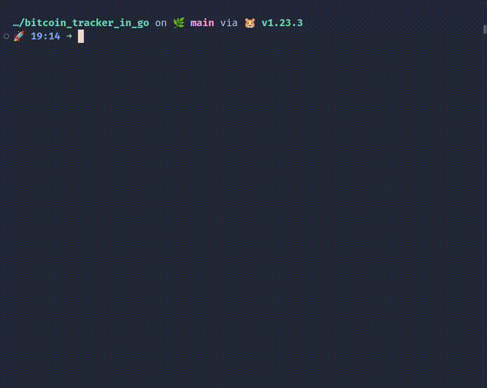

# Bitcoin Price Tracker

A command-line application that tracks Bitcoin prices in real-time, provides price alerts, and logs historical data.



## Features

- 🪙 Real-time Bitcoin price tracking
- 🌍 Multiple currency support
- 🚨 Configurable price alerts
- 📊 Historical price logging
- ⚡ Non-blocking updates using goroutines
- 🎨 Clean terminal UI

## Setup

1. **Clone the repository**
```bash
git clone https://github.com/helioLJ/bitcoin-tracker.git
cd bitcoin-tracker
```

2. **Install dependencies**
```bash
go mod download
```

3. **Configure the application**

Create a `.env` file in the root directory:
```env
UPDATE_INTERVAL=5s
CURRENCY=usd
ALERT_THRESHOLD=100000
```

- `UPDATE_INTERVAL`: How often to fetch new prices (e.g., 5s, 1m) // To prevent rate limiting, set to 1m
- `CURRENCY`: Default currency (e.g., usd, eur, gbp)
- `ALERT_THRESHOLD`: Price threshold for alerts

## Usage

1. **Run the application**
```bash
go run .
```

2. **Enter your preferred currency** when prompted, or press Enter to use the default from `.env`

3. **Monitor prices** - The UI will show:
   - Current Bitcoin price
   - Session price change percentage
   - Last update time
   - Price alerts when thresholds are crossed

4. **View price history** in `price_history.csv`

5. **Exit** with Ctrl+C

## Go Concepts Used

### 1. Packages and Project Structure
```
├── main.go           # Application entry point
├── tracker/          # Core tracking functionality
│   ├── api.go        # API interaction
│   ├── models.go     # Data structures
│   └── tracker.go    # Price tracking logic
└── utils/           # Utility functions
    ├── config.go    # Configuration management
    ├── error.go     # Error handling
    └── file.go      # File operations
```

### 2. Concurrency
- **Goroutines**: Used for background price fetching
- **Channels**: Communication between components
  - `priceChan`: Price updates
  - `errorChan`: Error handling
  - `alertChan`: Price alerts
  - `stopChan`: Graceful shutdown

### 3. Types and Interfaces
```go
type Tracker struct {
    config    utils.Config
    alerts    []Alert
    priceChan chan PriceData
    // ...
}

type PriceData struct {
    Price     float64
    Currency  string
    Timestamp time.Time
}
```

### 4. Error Handling
- Custom error types with context
- Graceful error display in UI
- Error propagation through channels

### 5. File I/O
- Configuration loading from `.env`
- CSV logging of price history

## Dependencies

- `github.com/joho/godotenv`: Environment variable management
- Standard library packages:
  - `net/http`: API requests
  - `encoding/json`: JSON parsing
  - `time`: Time operations
  - `os`: File operations

## Contributing

Feel free to submit issues and pull requests.
